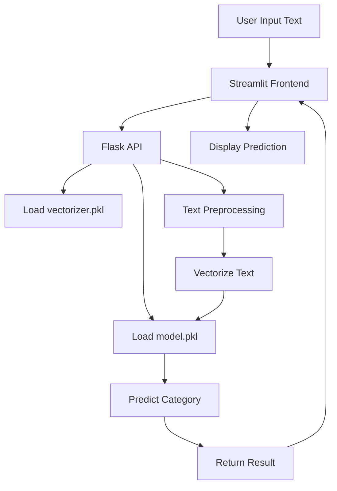

# TextClassifierProject

## Overview
An end-to-end AI project that classifies text inputs into categories using a trained ML model. The project includes a **Flask API** as backend and a **Streamlit frontend** for real-time interaction.

## Project Structure

| File | Purpose |
|------|---------|
| `data.py` | Load training dataset and category labels |
| `ML.py` | Train the Naive Bayes model and save necessary files |
| `app.py` | Flask backend API for predictions |
| `frontend.py` | Streamlit frontend interface |
| `model.pkl` | Trained ML model |
| `vectorizer.pkl` | Text vectorizer |
| `categories.pkl` | Category labels |
| `requirements.txt` | Python dependencies |

## Installation

**Clone the repository:**
```bash
git clone https://github.com/shahdkabi/TextClassifierProject/
cd TextClassifierProject
```

**Install dependencies:**
```bash
pip install -r requirements.txt
```

## Usage

**Flask API**
```bash
python app.py
```
*Server runs at:* http://127.0.0.1:5000/

**Streamlit Frontend**
```bash
streamlit run frontend.py
```
*Opens a web interface to enter text and see predictions*

## Examples

| Input | Output |
|-------|--------|
| "I want to buy a new car" | **Category:** Cars |
| "New research shows medicine can cure disease" | **Category:** Medical |

## Workflow Diagram



## Future Enhancements
- ✅ Show prediction confidence scores
- ✅ Support more categories
- ✅ Store predictions in a database
- ✅ Deploy online for public use
